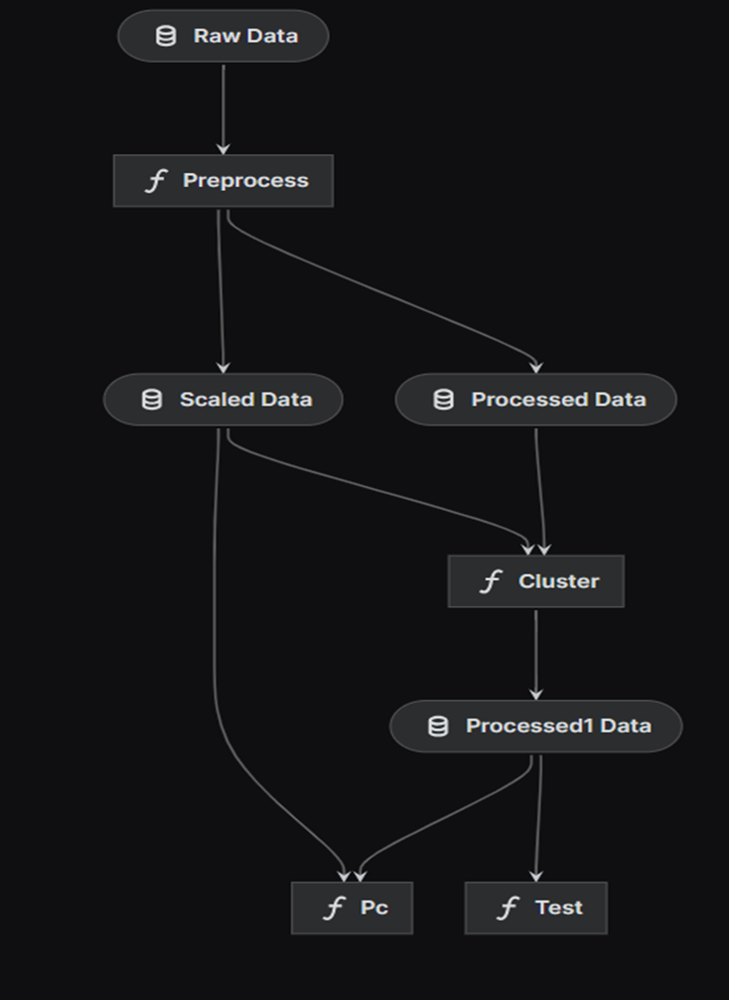
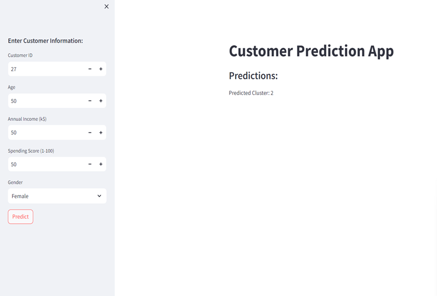

# CustomerSegmentation
# Objective
Analyze the customer dataset using unsupervised learning techniques to identify customer segments and provide recommendations for targeted marketing strategies.

# Data
The data used in this project is from kaggle website


# Deployment
Within the python environment of yout choice run:
```bash
git clone https://github.com/Srilasya22/CustomerSegmentation.git

pip install -r requirements.txt
```

# Kedro
Kedro is an open-source tool.It has the following features:

- ``Handles Complexity``: It provide a stucture to test data which can be pushed to production after successful testing.
 
- ``Standardisation``: It provides standard template for project. Making it earrlier to understand for others.
   
- ``Production-Ready``: Code can be easily pushed to production with exploratory code that you can transition to reproducible, maintainable, and modular experiments.

```bash

#Installing kedro

pip install kedro

#Installing kedro-viz

pip install kedro-viz

#To create new project

kedro new

#To create new pipeline

kedro pipeline create <pipeline-name>

#To run kedro

kedro run

#Visualizing pipeline

kedro viz run
```

# Solution
Once model is build, it can be deployed in production to track the model.Evidently AI can be used to track model performance. Using Kedro we can monitor the logs in real-time as well as old logs can also be checked.

# Training Pipeline
Our standard training pipeline consists of several steps:

1. ``data_preprocessing``: We will take the raw data and process it to standard polished data for model training.

2. ``train_test_split``: This pipeline will split the dataset into two part. On first part the model will be trained and on second set model will be tested.

3. ``Scaling``: Standardizing the training input and testing input
  
4. ``model_training``: This pipeline is used to train model on dataset using hyperparameter.

5. ``model_evaluation``: This pipeline is used to evaluate the model performance.

Below is the pipeline workflow which we will implement in this project:



# Log Analysis
Kedro can be used for log analysis as well.Here the log analysis of the project:


# Demo Streamlit App

There is a live demo of this project using Streamlit which you can find here. It takes some input features for the transaction and predicts whether the transaction is fraudlent or not. If you want to run this Streamlit app in your local system, you can run the following command to access the app locally:
```bash
streamlit run app.py
```



# Model Monitoring

Model monitoring is done using Evidently AI.It provides tools for monitoring the performance of machine learning models over time, helping users detect changes in model behavior.The platform includes dashboards and visualization tools to present insights and metrics related to model performance and explainability.
